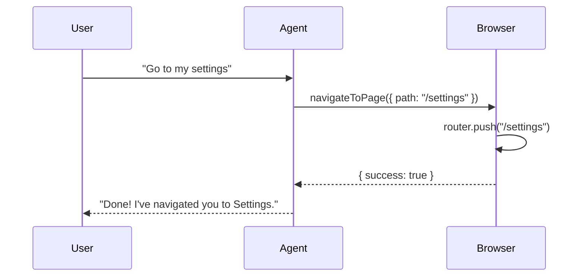

Client-side tools let your agent trigger actions in the user's browser—like navigating pages, showing modals, or interacting with your app's state.

## How It Works



1. **Define tools** — Upload a JSON spec describing available client-side actions
2. **Register handlers** — Implement the functions in your frontend
3. **Agent calls them** — The agent triggers your handlers when appropriate
4. **Agent sees results** — Your handler's return value is sent back to the agent, so it can confirm success or handle errors

---

## Setup

### 1. Create Your Tools Spec

Define tools using the OpenAI function format:

```json
[
  {
    "name": "navigateToPage",
    "description": "Navigate the user to a specific page in the application",
    "parameters": {
      "type": "object",
      "properties": {
        "path": {
          "type": "string",
          "description": "The page path to navigate to (e.g., '/settings', '/orders')"
        }
      },
      "required": ["path"]
    }
  },
  {
    "name": "showUpgradeModal",
    "description": "Display the upgrade/pricing modal to the user",
    "parameters": {
      "type": "object",
      "properties": {}
    }
  }
]
```

### 2. Upload to Crow

In **Integration** → **Client Side**:

1. Click **Upload JSON**
2. Select your tools spec file
3. Your tools will appear in the list

### 3. Register Handlers

Implement the functions that execute when the agent calls each tool:

<Tabs>
  <Tab title="Script Tag">
    ```javascript
    window.crow('registerTools', {
      navigateToPage: async ({ path }) => {
        router.push(path)
        return { success: true }
      },
      
      showUpgradeModal: async () => {
        document.getElementById('upgrade-modal').showModal()
        return { shown: true }
      }
    })
    ```

    <Accordion title="React/SPA timing">
    Wait for the widget to load:
    ```javascript
    useEffect(() => {
      const i = setInterval(() => {
        if (!window.crow) return
        window.crow('registerTools', { /* your tools */ })
        clearInterval(i)
      }, 100)
      return () => clearInterval(i)
    }, [])
    ```
    </Accordion>
  </Tab>

  <Tab title="React SDK">
    ```tsx
    import { CrowWidget } from '@usecrow/ui';
    import '@usecrow/ui/styles.css';

    function App() {
      const tools = {
        navigateToPage: async ({ path }) => {
          router.push(path);
          return { success: true };
        },
        
        showUpgradeModal: async () => {
          document.getElementById('upgrade-modal').showModal();
          return { shown: true };
        }
      };

      return (
        <CrowWidget
          productId="YOUR_PRODUCT_ID"
          apiUrl="https://api.usecrow.org"
          tools={tools}
        />
      );
    }
    ```

    <Accordion title="With CrowProvider">
    When using multiple components:
    ```tsx
    import { CrowProvider, CrowCopilot, useCrowClient } from '@usecrow/ui';
    import { useEffect } from 'react';

    function ToolRegistration() {
      const client = useCrowClient();
      
      useEffect(() => {
        client.registerTools({
          navigateToPage: async ({ path }) => {
            router.push(path);
            return { success: true };
          }
        });
      }, [client]);

      return null;
    }

    function App() {
      return (
        <CrowProvider productId="YOUR_PRODUCT_ID" apiUrl="https://api.usecrow.org">
          <ToolRegistration />
          <YourApp />
          <CrowCopilot position="right" />
        </CrowProvider>
      );
    }
    ```
    </Accordion>
  </Tab>
</Tabs>

<Warning>
The tool `name` in your JSON spec must exactly match the key in your handlers.
</Warning>

### 4. Verify in Dashboard

Go to [Actions](https://app.usecrow.ai/actions) to confirm your client tools are listed under **Client-Side Tools**.

---

## Example Tools

### Navigation

```json
{
  "name": "navigateToPage",
  "description": "Navigate to a page. Use for: settings, orders, profile, dashboard, billing",
  "parameters": {
    "type": "object",
    "properties": {
      "path": {
        "type": "string",
        "description": "Page path like '/settings' or '/orders/123'"
      }
    },
    "required": ["path"]
  }
}
```

<Tabs>
  <Tab title="Script Tag">
    ```javascript
    window.crow('registerTools', {
      navigateToPage: async ({ path }) => {
        router.push(path)
        return { success: true }
      }
    })
    ```
  </Tab>
  <Tab title="React SDK">
    ```tsx
    const tools = {
      navigateToPage: async ({ path }) => {
        router.push(path);
        return { success: true };
      }
    };
    
    <CrowWidget tools={tools} /* ... */ />
    ```
  </Tab>
</Tabs>

### UI Actions

```json
{
  "name": "openContactForm",
  "description": "Open the contact support form modal",
  "parameters": {
    "type": "object",
    "properties": {
      "subject": {
        "type": "string",
        "description": "Pre-fill the subject line"
      }
    }
  }
}
```

<Tabs>
  <Tab title="Script Tag">
    ```javascript
    window.crow('registerTools', {
      openContactForm: async ({ subject }) => {
        openModal('contact', { subject })
        return { opened: true }
      }
    })
    ```
  </Tab>
  <Tab title="React SDK">
    ```tsx
    const tools = {
      openContactForm: async ({ subject }) => {
        openModal('contact', { subject });
        return { opened: true };
      }
    };
    
    <CrowWidget tools={tools} /* ... */ />
    ```
  </Tab>
</Tabs>

### App State

```json
{
  "name": "addToCart",
  "description": "Add a product to the user's shopping cart",
  "parameters": {
    "type": "object",
    "properties": {
      "productId": { "type": "string", "description": "The product ID" },
      "quantity": { "type": "integer", "description": "Number of items (default 1)" }
    },
    "required": ["productId"]
  }
}
```

<Tabs>
  <Tab title="Script Tag">
    ```javascript
    window.crow('registerTools', {
      addToCart: async ({ productId, quantity = 1 }) => {
        await cartStore.add(productId, quantity)
        return { success: true }
      }
    })
    ```
  </Tab>
  <Tab title="React SDK">
    ```tsx
    const tools = {
      addToCart: async ({ productId, quantity = 1 }) => {
        await cartStore.add(productId, quantity);
        return { success: true };
      }
    };
    
    <CrowWidget tools={tools} /* ... */ />
    ```
  </Tab>
</Tabs>

---

## Spec Format

Client-side tools use the [OpenAI function calling format](https://platform.openai.com/docs/guides/function-calling):

| Field | Type | Required | Description |
|-------|------|----------|-------------|
| `name` | string | Yes | Unique tool identifier |
| `description` | string | Yes | When to use this tool—be specific |
| `parameters` | object | Yes | JSON Schema for parameters |

Supported types: `string`, `number`, `integer`, `boolean`, `array`, `object`

---

## Best Practices

- **Descriptive names** — `navigateToSettings` beats `nav1`
- **Detailed descriptions** — Tell the agent exactly when to use each tool
- **List valid values** — "Use for: settings, orders, profile" helps the agent choose
- **Handle errors** — Your handlers should gracefully handle edge cases
- **Return meaningful results** — The agent sees your return value and can react accordingly

---

## Tool Results

The agent sees whatever your tool handler returns. This enables the agent to confirm success, handle errors, and provide relevant follow-up responses.

### Return Format

Your handlers should return an object describing the outcome:

```javascript
// Success
return { success: true, data: { ... } }

// Error
return { success: false, error: "Page not found" }
```

### Examples

**Success with context:**
```javascript
navigateToPage: async ({ path }) => {
  router.push(path);
  return { 
    success: true, 
    navigatedTo: path,
    pageTitle: document.title 
  };
}
```

**Error handling:**
```javascript
navigateToPage: async ({ path }) => {
  const validPaths = ['/settings', '/orders', '/profile'];
  if (!validPaths.includes(path)) {
    return { 
      success: false, 
      error: `Page "${path}" not found`,
      validPaths 
    };
  }
  router.push(path);
  return { success: true };
}
```

<Info>
If your handler throws an exception, the SDK automatically catches it and sends an error result to the agent. You don't need to wrap everything in try/catch unless you want custom error messages.
</Info>

### What the Agent Sees

| Your Handler Returns | Agent Response |
|---------------------|----------------|
| `{ success: true }` | "Done! I've navigated you to Settings." |
| `{ success: false, error: "Page not found" }` | "I tried to navigate but that page doesn't exist. Would you like me to show you the available pages?" |
| *Exception thrown* | "I encountered an error trying to navigate. Let me try something else." |

### Agent Feedback Flow

When a client-side tool executes, the agent follows a two-step response pattern:

1. **Acknowledge** — "I'm navigating you to Settings now..."
2. **Confirm** — After receiving the result: "Done! You're now on the Settings page."

This ensures users see immediate feedback while the action executes.

### Automatic Retries

If your tool returns an error, the agent can automatically retry with corrected parameters:

```javascript
navigateToPage: async ({ page }) => {
  const validPages = ['settings', 'orders', 'profile'];
  if (!validPages.includes(page)) {
    return { 
      success: false, 
      error: `Invalid page "${page}". Valid options: ${validPages.join(', ')}` 
    };
  }
  router.push(`/${page}`);
  return { success: true };
}
```

**User:** "Go to production"  
**Agent:** "I'm navigating you there now..."  
**Agent:** "That page doesn't exist. Let me try navigating to Settings instead..."  
**Agent:** "Done! You're now on Settings."

The agent decides whether to retry based on the error message—no configuration needed.

---

## Troubleshooting

| Issue | Solution |
|-------|----------|
| Tool not appearing | Check JSON syntax, ensure `name` field exists |
| Agent not calling tool | Improve the `description` to better match user queries |
| Handler not executing | Verify `name` in spec matches key in handlers exactly |
| Parameters missing | Check `required` array in your spec |

---

<CardGroup cols={2}>
  <Card title="Embed Widget" icon="code" href="/embed-widget">
    Full installation guide
  </Card>
  <Card title="OpenAPI" icon="server" href="/openapi">
    Connect your backend API
  </Card>
</CardGroup>
