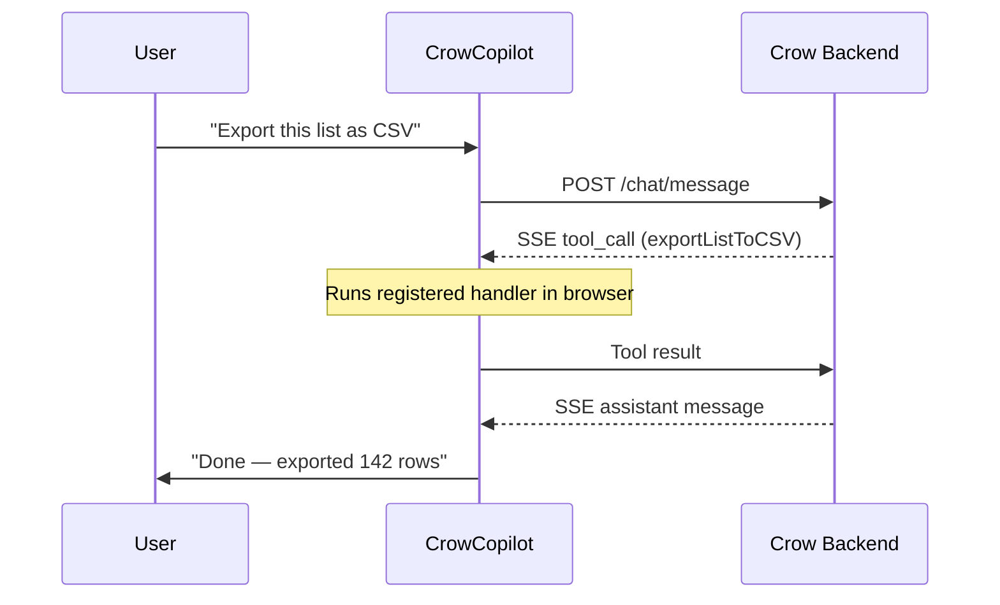

Client-side tools execute in the browser instead of on a server. You register handlers via `window.crow('registerTools', {...})`, and the agent calls them like any other tool — but the work happens client-side.

## When to Use

Use client-side tools for **browser-only actions**:
- CSV/file downloads
- Page navigation
- DOM manipulation
- Accessing client-side state (stores, localStorage)

Use server-side tools (OpenAPI/MCP) for API calls, database queries, and anything that requires backend access.

---

## Setup

### 1. Register Handlers

In your app code, register functions the widget can call:

```js
window.crow('registerTools', {
  exportListToCSV: async ({ fileName }) => {
    // ... build CSV from app state
    downloadCsv(data, fileName || 'export');
    return { status: 'success', rows_exported: data.length };
  }
});
```

### 2. Upload Tool Definitions

On the [Actions](https://app.usecrow.ai/actions) page, upload a JSON definition so the agent knows the tool exists:

```json
[{
  "name": "exportListToCSV",
  "description": "Export the current list to a CSV file. Downloads directly to the user's browser.",
  "parameters": {
    "type": "object",
    "properties": {
      "fileName": { "type": "string", "description": "Name for the CSV file" }
    },
    "required": []
  }
}]
```

Good descriptions help the agent decide when to use the tool.

---

## Handler Contract

Each handler receives an `args` object matching the tool's `parameters` schema and must return an object.

| Outcome | Return value |
|---------|-------------|
| **Success** | `{ status: "success", ...data }` |
| **Failure** | `{ status: "error", error: "message" }` |

The returned object is sent back to the agent so it can incorporate the result into its response.

---

## Showing a Loading State

For tools that take a few seconds, call `setToolStatus` to show a spinning indicator with a status message inside the widget. Clear it when done.

```js
window.crow('registerTools', {
  createAndPopulateList: async ({ listName }) => {
    window.crow('setToolStatus', 'Creating list...');
    await createList(listName);

    window.crow('setToolStatus', 'Adding leads...');
    await addLeads();

    window.crow('setToolStatus', ''); // clear
    return { status: 'success' };
  }
});
```

The status appears above the input box with a spinner while non-empty, and disappears when set to `''`.

---

## How It Works



1. **User asks** — The message is sent to the agent
2. **Agent picks the tool** — Based on the tool definition
3. **Widget runs the handler** — Executes your registered function client-side
4. **Result flows back** — The agent sees the return value and responds

---

<CardGroup cols={2}>
  <Card title="Tool Renderers" icon="paintbrush" href="/tool-renderers">
    Render custom UI for tool results
  </Card>
  <Card title="Embed Widget" icon="code" href="/embed-widget">
    Full installation guide
  </Card>
</CardGroup>
