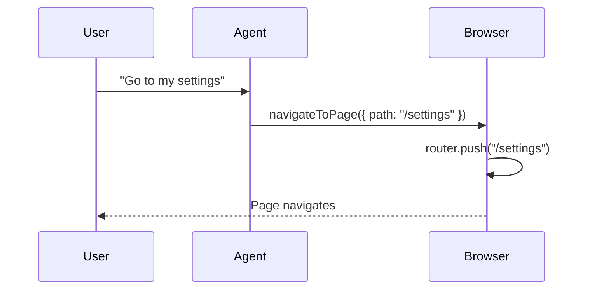

Client-side tools let your agent trigger actions in the user's browser—like navigating pages, showing modals, or interacting with your app's state.

## How It Works



1. **Define tools** — Upload a JSON spec describing available client-side actions
2. **Register handlers** — Implement the actual functions in your frontend
3. **Agent calls them** — When appropriate, the agent triggers your handlers

---

## Setup

### 1. Create Your Tools Spec

Define tools using the OpenAI function format:

```json
[
  {
    "name": "navigateToPage",
    "description": "Navigate the user to a specific page in the application",
    "parameters": {
      "type": "object",
      "properties": {
        "path": {
          "type": "string",
          "description": "The page path to navigate to (e.g., '/settings', '/orders')"
        }
      },
      "required": ["path"]
    }
  },
  {
    "name": "showUpgradeModal",
    "description": "Display the upgrade/pricing modal to the user",
    "parameters": {
      "type": "object",
      "properties": {}
    }
  }
]
```

### 2. Upload to Crow

In **Integration** → **Client Side**:

1. Click **Upload JSON**
2. Select your tools spec file
3. Your tools will appear in the list

### 3. Register Handlers

In your frontend, register functions that execute when the agent calls each tool:

```javascript
window.crow('registerTools', {
  navigateToPage: async ({ path }) => {
    // Use your app's router
    router.push(path)
    return { success: true }
  },
  
  showUpgradeModal: async () => {
    document.getElementById('upgrade-modal').showModal()
    return { shown: true }
  }
})
```

<Warning>
The tool `name` in your JSON spec must exactly match the key in `registerTools`.
</Warning>

### 4. Enable in Actions

Go to [Actions](https://app.usecrow.ai/actions) to verify your client tools are listed under **Client-Side Tools**.

---

## Example Tools

### Navigation

```json
{
  "name": "navigateToPage",
  "description": "Navigate to a page. Use for: settings, orders, profile, dashboard, billing",
  "parameters": {
    "type": "object",
    "properties": {
      "path": {
        "type": "string",
        "description": "Page path like '/settings' or '/orders/123'"
      }
    },
    "required": ["path"]
  }
}
```

```javascript
window.crow('registerTools', {
  navigateToPage: async ({ path }) => {
    router.push(path)
    return { success: true }
  }
})
```

### UI Actions

```json
{
  "name": "openContactForm",
  "description": "Open the contact support form modal",
  "parameters": {
    "type": "object",
    "properties": {
      "subject": {
        "type": "string",
        "description": "Pre-fill the subject line"
      }
    }
  }
}
```

```javascript
window.crow('registerTools', {
  openContactForm: async ({ subject }) => {
    openModal('contact', { subject })
    return { opened: true }
  }
})
```

### App State

```json
{
  "name": "addToCart",
  "description": "Add a product to the user's shopping cart",
  "parameters": {
    "type": "object",
    "properties": {
      "productId": {
        "type": "string",
        "description": "The product ID to add"
      },
      "quantity": {
        "type": "integer",
        "description": "Number of items (default 1)"
      }
    },
    "required": ["productId"]
  }
}
```

```javascript
window.crow('registerTools', {
  addToCart: async ({ productId, quantity = 1 }) => {
    await cartStore.add(productId, quantity)
    return { success: true }
  }
})
```

---

## Spec Format

Client-side tools use the [OpenAI function calling format](https://platform.openai.com/docs/guides/function-calling):

| Field | Type | Required | Description |
|-------|------|----------|-------------|
| `name` | string | Yes | Unique tool identifier (used in `registerTools`) |
| `description` | string | Yes | When to use this tool—be specific |
| `parameters` | object | Yes | JSON Schema for parameters |

### Parameters Schema

```json
{
  "type": "object",
  "properties": {
    "paramName": {
      "type": "string",
      "description": "What this parameter does"
    }
  },
  "required": ["paramName"]
}
```

Supported types: `string`, `number`, `integer`, `boolean`, `array`, `object`

---

## Best Practices

- **Descriptive names** — `navigateToSettings` is clearer than `nav1`
- **Detailed descriptions** — Tell the agent exactly when to use each tool
- **List valid values** — "Use for: settings, orders, profile" helps the agent choose correctly
- **Handle errors** — Your handlers should gracefully handle edge cases

---

## Troubleshooting

| Issue | Solution |
|-------|----------|
| Tool not appearing | Check JSON syntax, ensure `name` field exists |
| Agent not calling tool | Improve the `description` to better match user queries |
| Handler not executing | Verify `name` in spec matches key in `registerTools` exactly |
| Parameters missing | Check `required` array in your spec |

<Note>
Client tools run in the browser and are currently fire-and-forget—the agent triggers them but doesn't see return values. Interested in bidirectional results? [Book a demo](https://cal.com/aryan-vij-wpimwt/30min).
</Note>

---

<CardGroup cols={2}>
  <Card title="Embed Widget" icon="code" href="/embed-widget">
    Full JavaScript API reference
  </Card>
  <Card title="OpenAPI" icon="server" href="/openapi">
    Connect your backend API
  </Card>
</CardGroup>
