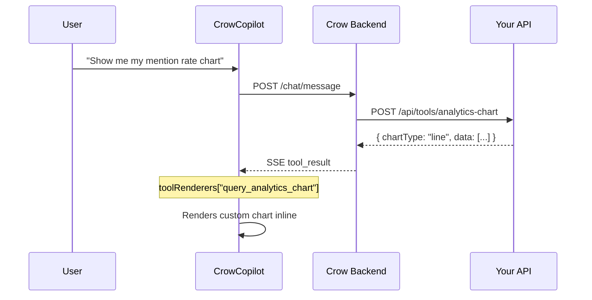

Tool renderers let you display custom UI — like charts, tables, or cards — directly inside the chat when a server-side tool returns data.

## How It Works



1. **Agent calls a tool** — The backend executes a server-side tool and returns structured data
2. **Result arrives via SSE** — The `tool_result` event streams back with the tool name and result payload
3. **Widget checks `toolRenderers`** — If a renderer exists for that tool name, it renders your component
4. **Custom component appears inline** — Your chart/table/card renders directly below the tool call status

---

## Setup

### 1. Define Your Renderers

Create React components that accept `{ result, status }` props:

```tsx
function MyChart({ result }: { result: unknown; status: string }) {
  const data = result as { chartType: string; data: Array<{ date: string; value: number }> };
  if (!data?.data) return null;
  
  return (
    <div className="my-chart">
      {/* Your chart component */}
    </div>
  );
}
```

### 2. Pass to CrowCopilot

```tsx
import { CrowCopilot } from '@usecrow/ui';
import '@usecrow/ui/styles.css';

function App() {
  return (
    <CrowCopilot
      productId="YOUR_PRODUCT_ID"
      apiUrl="https://api.usecrow.org"
      toolRenderers={{
        query_analytics_chart: MyChart,
        query_citation_chart: MyChart,
        get_competitor_trends: MyChart,
      }}
    />
  );
}
```

---

## Renderer Props

Each renderer receives:

| Prop | Type | Description |
|------|------|-------------|
| `result` | `unknown` | The full result payload from the tool execution |
| `status` | `string` | Tool status: `"complete"` or `"error"` |

<Info>
Renderers are only called when the tool completes successfully (`status === "complete"`) and the result is not null. You don't need to check for these conditions.
</Info>

---

## Example: Chart Renderer

Here's a full example rendering a Recharts line chart from analytics tool results:

```tsx
import { LineChart, Line, XAxis, YAxis, ResponsiveContainer } from 'recharts';

function AnalyticsChart({ result }: { result: unknown; status: string }) {
  const r = result as {
    chartType: string;
    title: string;
    color: string;
    data: Array<{ date: string; value: number }>;
    currentValue: number | null;
    unit: string;
  } | null;

  if (!r || r.chartType !== 'line' || !r.data?.length) return null;

  return (
    <div className="rounded-lg border p-3">
      <h4 className="text-sm font-medium mb-2">{r.title}</h4>
      {r.currentValue != null && (
        <p className="text-xl font-bold">{r.currentValue}{r.unit}</p>
      )}
      <div style={{ height: 160 }}>
        <ResponsiveContainer width="100%" height="100%">
          <LineChart data={r.data}>
            <XAxis dataKey="date" tick={{ fontSize: 10 }} />
            <YAxis tick={{ fontSize: 10 }} />
            <Line
              type="monotone"
              dataKey="value"
              stroke={r.color || '#6366f1'}
              strokeWidth={2}
            />
          </LineChart>
        </ResponsiveContainer>
      </div>
    </div>
  );
}

// Use the same renderer for multiple chart tools
<CrowCopilot
  productId="YOUR_PRODUCT_ID"
  apiUrl="https://api.usecrow.org"
  toolRenderers={{
    query_analytics_chart: AnalyticsChart,
    query_citation_chart: AnalyticsChart,
    get_competitor_trends: AnalyticsChart,
  }}
/>
```

---

## TypeScript

Import the `ToolRenderers` type for type-safe renderer maps:

```tsx
import type { ToolRenderers } from '@usecrow/ui';

const renderers: ToolRenderers = {
  my_tool: ({ result, status }) => <MyComponent data={result} />,
};
```

---

## Without a Renderer

When no `toolRenderers` entry exists for a tool, the widget shows the default behavior: a checkmark with the tool name and "done" status. Adding a renderer enhances this — it doesn't replace the status indicator, it adds your component below it.

---

<CardGroup cols={2}>
  <Card title="Embed Widget" icon="code" href="/embed-widget">
    Full installation guide
  </Card>
  <Card title="Client-Side Tools" icon="browser" href="/client-side-tools">
    Browser-side tool handlers
  </Card>
</CardGroup>
